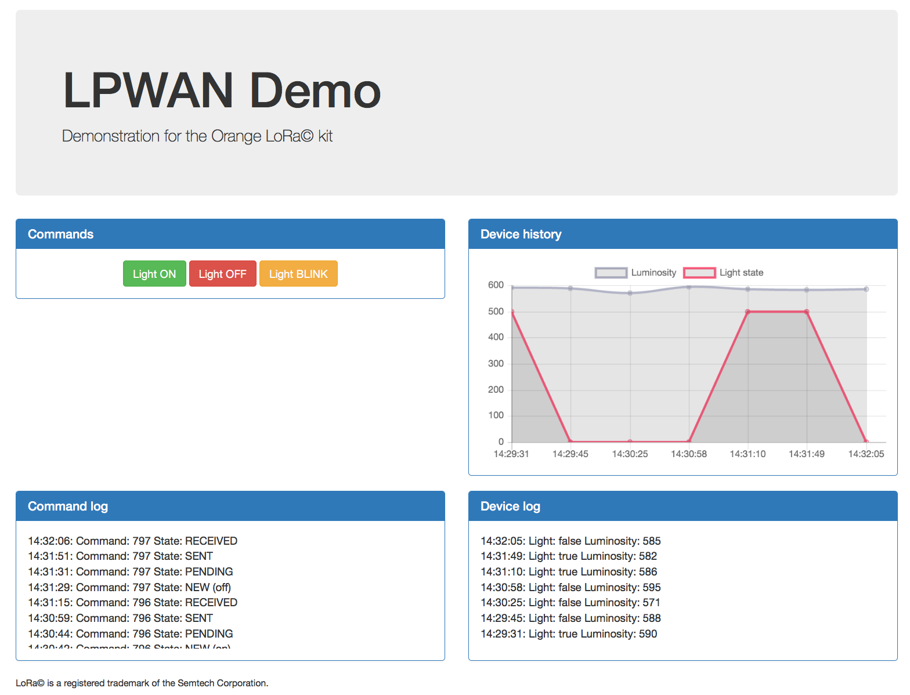

# Orange LoRa© Kit Demo

This is an unofficial demo for the Orange LoRa© kit, official demo is hosted there: https://github.com/Orange-OpenSource/lpwa-iot-kit



## Server

To run the server, you need a working [Go](http://golang.org) setup.

    go get github.com/marcc-orange/lwpa-demo

The demo server requires some mandatory flags to run correctly:

```
./lwpa-demo -h

-appSKey key
      application session key, mandatory
-devAddr address
      device address, mandatory
-dvCommandStream ID
      Datavenue Downlink Command Stream ID, mandatory
-dvDatasource ID
      Datavenue Datasource ID, mandatory
-dvFDownlinkFCntStream ID
      Datavenue Downlink FCnt Stream ID, mandatory
-dvISSKey key
      Datavenue Primary key, mandatory
-dvOAPIKey key
      Datavenue Orange Partner key, mandatory
-dvURL string
      Datavenue URL (default "https://api.orange.com/datavenue/v1")
-listen string
      address and port to listen (default ":8080")
```

The server expects the Datavenue platform to send push requests to the `/demo/push` path.

Point your browser to the root of the server, it should display the demo interface.

## Using the kit

* Use the provided Seeeduino Stalker v2.3 and Atim LoRa© radio boards.
* Connect the Grove light sensor and optionnay a Grove button.
* Flash the Seeduino with the `LWPAKitDemo` sketch from the arduino folder.

The device will send data periodicaly (every 2 min) and respond to commands.

# Live Demo

You can see a live demo [here](http://lwpa-dev.kermit.orange-labs.fr/).

## Licence

Copyright (C) 2015 Orange

Licensed under the Apache License, Version 2.0 (the "License");
you may not use this file except in compliance with the License.
You may obtain a copy of the License at

  http://www.apache.org/licenses/LICENSE-2.0

Unless required by applicable law or agreed to in writing, software
distributed under the License is distributed on an "AS IS" BASIS,
WITHOUT WARRANTIES OR CONDITIONS OF ANY KIND, either express or implied.
See the License for the specific language governing permissions and
limitations under the License.

## Trademarks

LoRa© and LoRaWAN© are registered trademarks of Semtech Corporation.

Arduino is a registered trademark of Arduino LLC.
